% MTurk and You
% Pierce Edmiston

## Why mTurk?

### 

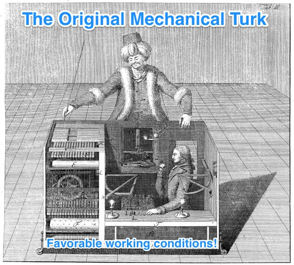

### 1. Fast

* \> 500,000 workers.
* 24/7 workforce.

### 2. Cheap

* Median price is $0.06/task.
* Great for norming and piloting.

### 3. Flexible

### 4. Diverse*

* 40% US.
* 40% India.
* \+ 100 countries.

### *does it matter?

Many effects are surprisingly homogeneous.

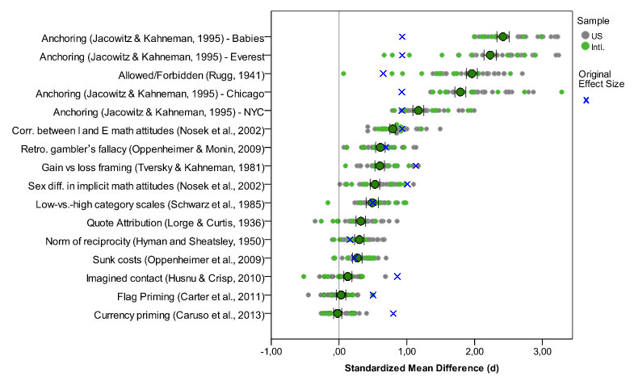

## Running an Experiment

### 

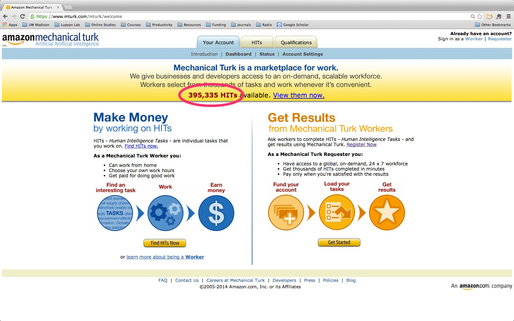

### 

1. **HIT** (Human Intelligence Task)
2. **Requester** (the Researcher)
3. **Worker** (the Participants)

### 

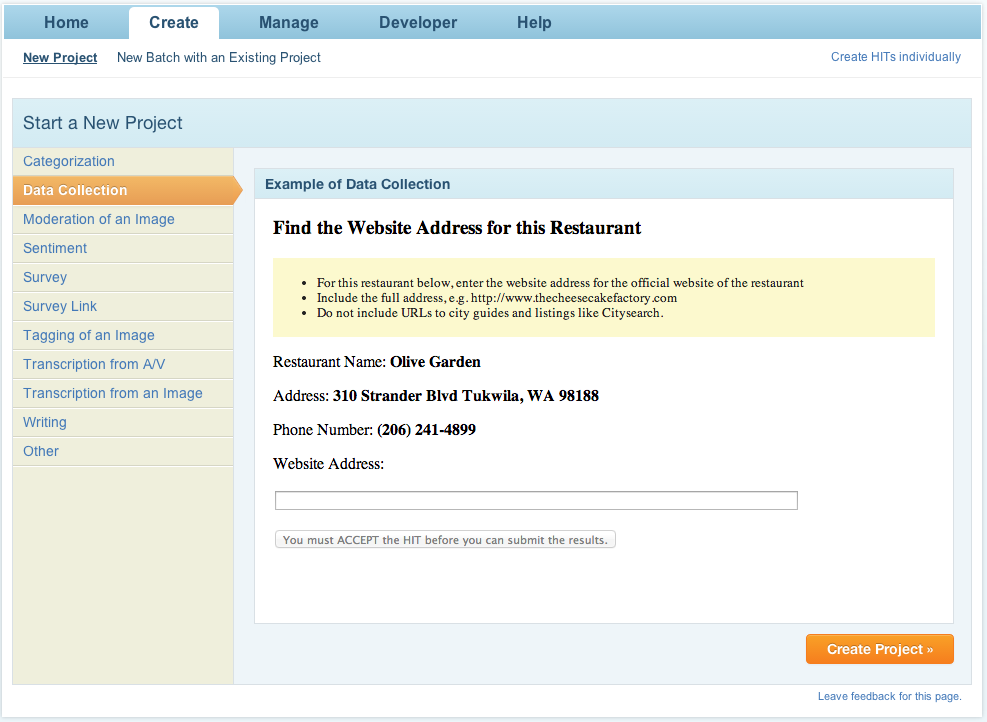

### 

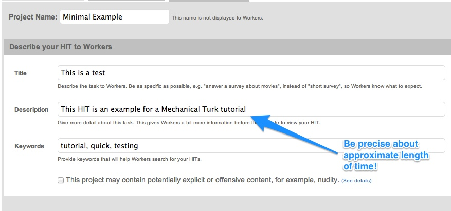

### 

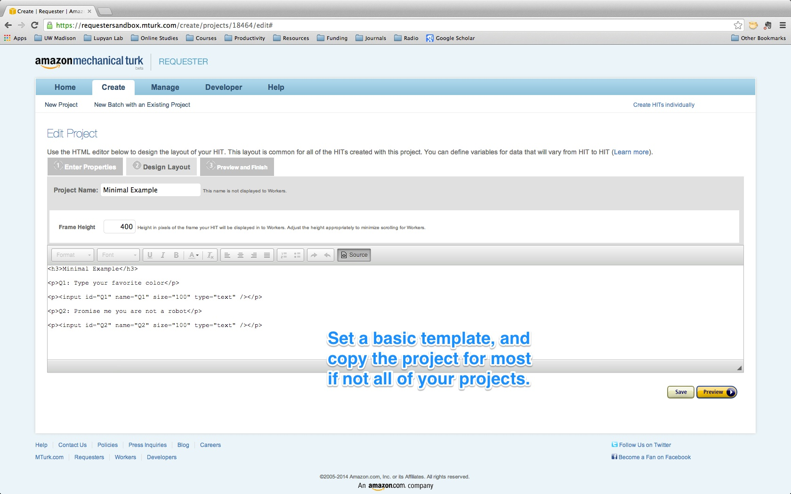

### 

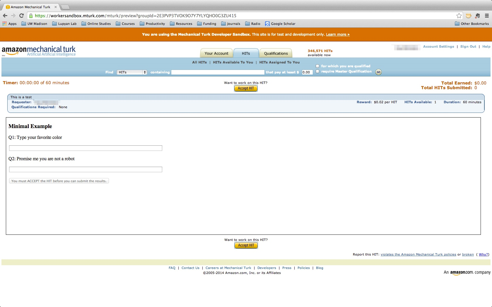

## Payment

### 

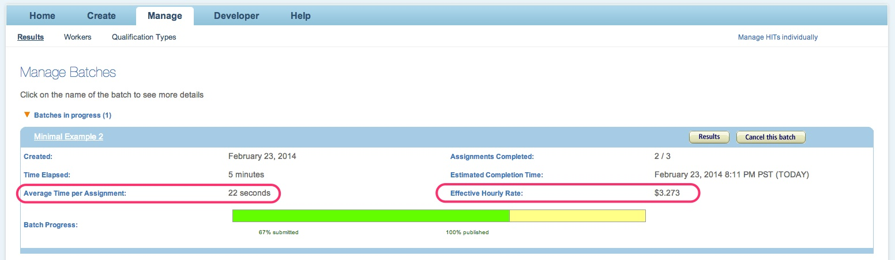

### 

**Problem:** Don't want to pay bad participants.

**Solution:** Use a verification system.

### 

### 

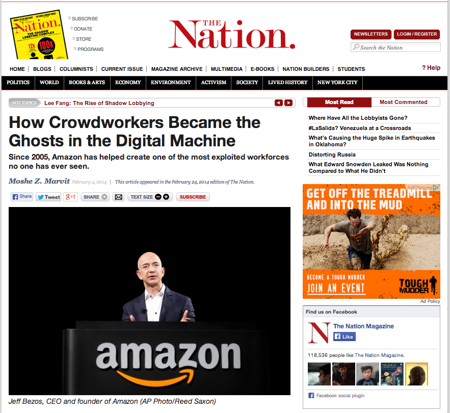

### 

> Before the Internet, it would be really difficult to find someone, sit them down for ten minutes and get them to work for you, and then fire them after those ten minutes. But with technology, you can actually find them, pay them the tiny amount of money, and then get rid of them when you don’t need them anymore.

[The Ghosts in the Machine](http://www.thenation.com/article/178241/how-crowdworkers-became-ghosts-digital-machine?page=0,0)

## mTurk + Qualtrics

## Method 1

### Survey Code

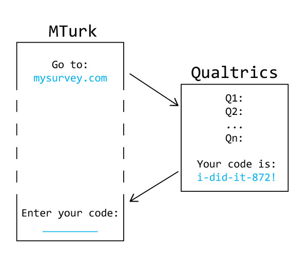

## Method 2

### Catch Questions

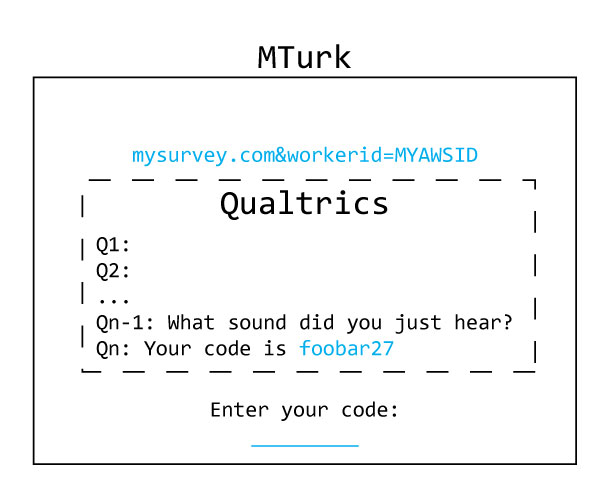

## Method 3

### Full Verification

* Random codes are generated per subject.
* Codes are saved to be verified later.
* Probably overkill.

## psiTurk

### 

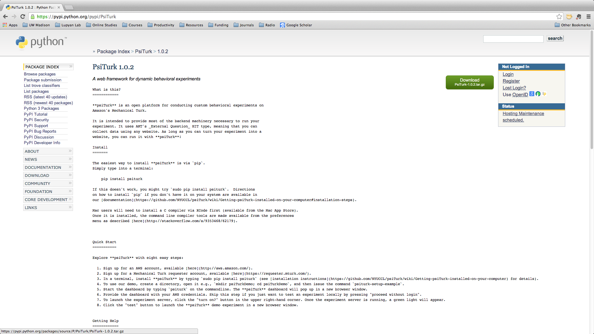

### 

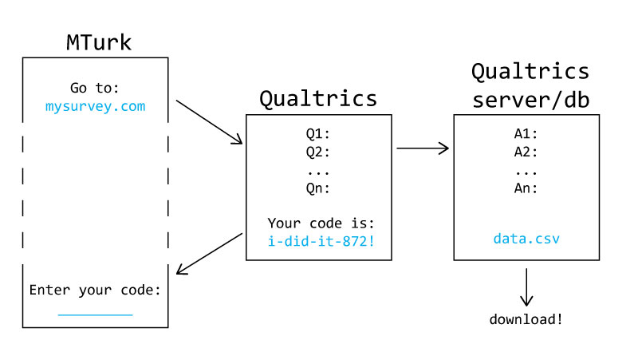

### 

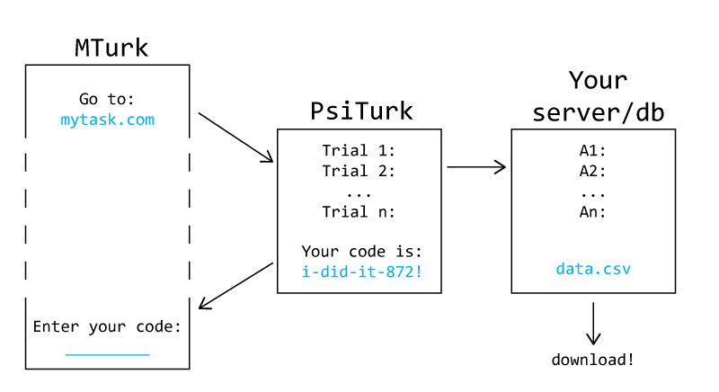

## Reaction Times

### 

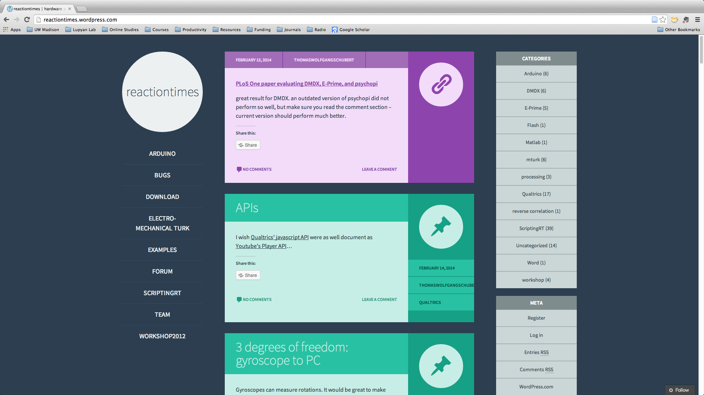

### Demos

* <a href="http://dl.dropbox.com/u/1009114/scriptingrt/demo.html" target="_blank">Display</a>
* <a href="http://isctecis.us2.qualtrics.com/SE/?SID=SV_bOVwgxx4d2aFvJG&mtwid=99999" target="_blank">RTs (in Qualtrics!)</a>

## Replication

### 

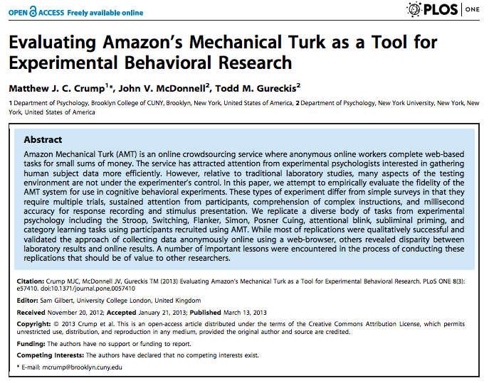

###

Attempted to replicate:

* Reaction time experiments (flanker, stroop)
* Rapid stimulus presentation (attentional blink, masked priming)
* Learning studies (category learning)

### RT effects

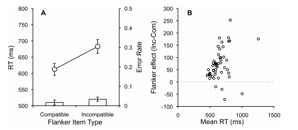

### Learning tasks

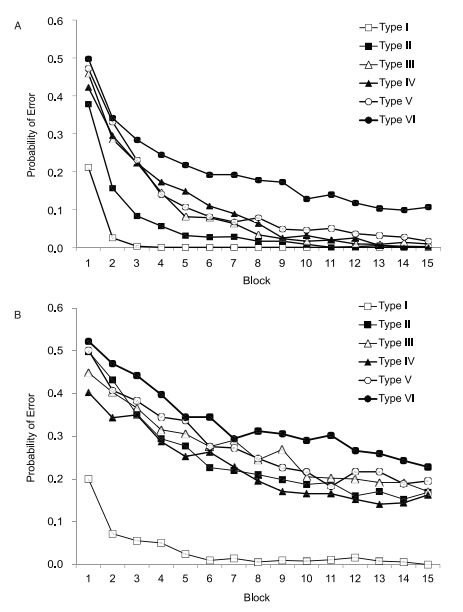

### Incentives

