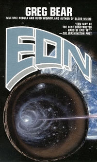

<aside class="notes">
    To introduce this concept of words as unmotivated cues, I'd like to start with an example from a science fiction novel I read some time ago. The reason I like this example is because it effectively highlights the unmotivated nature of language, but interestingly it treats it not as a facet, but as a flaw---something that can be improved.
</aside>

## Graphicspeak: the future of language

- holograms projected from neck device
- symbols and icons with emotional "flair"

<aside class="notes">
    The book is called Eon, and in it the author Greg Bear lets members of today's society encounter the future of the human race in the depths of this asteroid shown on the cover. The relevant part of the story is that the ubiquitous language of the future is something called "graphicspeak". In graphicspeak people communicate using a mixture of both traditional, spoken language and what are called picts---3D holograms projected alongside the speakers face from a device they wear around their necks. These picts convey conventionalized symbols and iconic signs that are changed dynamically in order to reflect various aspects of the speakers internal state.
</aside>

## {#example}

<aside class="notes">
   So as an example, at one point in the book...
</aside>

## {#snl}

## Intuition: Graphicspeak is better

- communication is faster, more efficient
- meaning is dynamic, multidimensional
- _cues are more precise_

<aside class="notes">
   The intuition Bear captures is that graphicspeak is better than language today, and the reason is that signals that dynamically reflect aspects of the current situation are more precise---they have the capacity to convey abstract things more concretely than words.
</aside>
